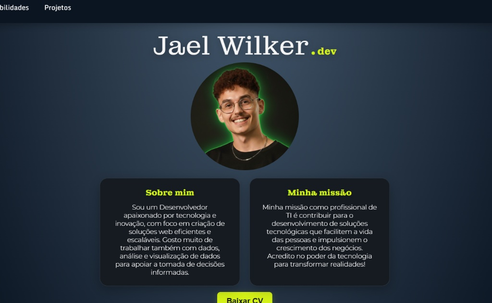

# Jael Wilker - Portfólio Pessoal

Este é o repositório do meu portfólio pessoal, uma página web desenvolvida para apresentar minhas habilidades, projetos e trajetória profissional. O projeto foi criado com foco em um design limpo, responsivo e uma experiência de usuário intuitiva.

## 🚀 Acesso

**Você pode acessar a versão ao vivo do projeto aqui:** [**jaelwilker.dev**](https://bit.ly/portifolioDevWilker)

## 📸 Screenshot



---

## ✨ Funcionalidades

- **Design Responsivo**: Totalmente adaptável para desktops, tablets e celulares.
- **Navegação Suave**: Scroll suave entre as seções para uma melhor experiência de usuário.
- **Menu Interativo**: Menu de navegação que destaca a seção ativa durante o scroll e menu mobile funcional.
- **Seções Detalhadas**: Áreas dedicadas para "Sobre mim", "Habilidades" e "Projetos".
- **Código Limpo**: Desenvolvido com HTML semântico, CSS moderno e JavaScript modular.

---

## 🛠️ Tecnologias Utilizadas

O projeto foi construído utilizando as seguintes tecnologias:

- **Figma**: Para o design e prototipação da interface (UI/UX).
- **HTML5**: Para a estrutura e semântica do conteúdo.
- **CSS3**: Para estilização, layout (Flexbox, Grid) e responsividade.
- **JavaScript (ES6+)**: Para interatividade, como o menu mobile e o scroll spy.

---

## 🏁 Como Executar o Projeto

```bash
# 1. Clone o repositório
git clone https://github.com/JaelWilker/portifolio.dev.git

# 2. Abra o arquivo index.html no seu navegador de preferência.
```
